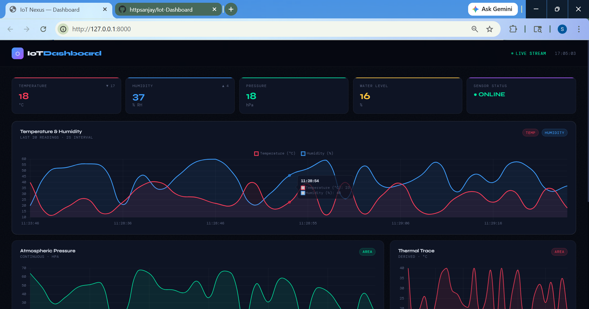
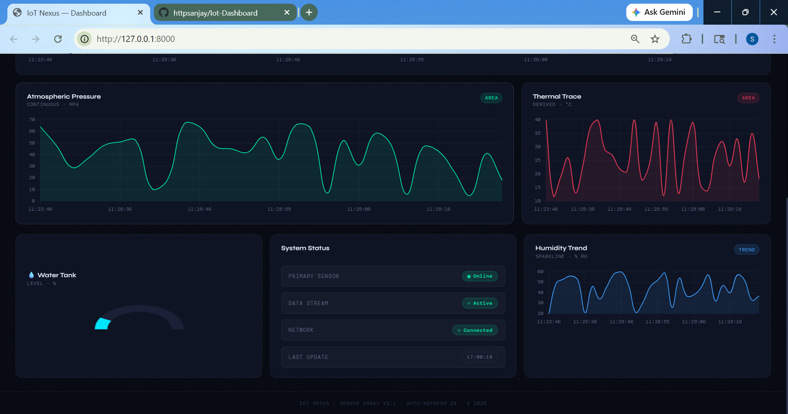

# IoT Dashboard

A real-time IoT monitoring dashboard that visualizes live sensor data with a clean, dark-themed UI. Built with Django and Chart.js. 

## Overview
This project is a real-time IoT dashboard built using:
- Django (Backend)
- MQTT (Data ingestion)
- Chart.js (Frontend visualization)

---

## Dashboard UI

### Main Dashboard




---


## Features

- Real-time data updates (2s interval)
- MQTT integration
- Multiple chart types:
  - Line chart
  - Area chart
  - Gauge chart
- Sensor status monitoring
- Modern UI (Glassmorphism)

---

## API Endpoint

### GET /get-data/

Returns:
```json
[
  {
    "temperature": 30,
    "humidity": 50,
    "pressure": 1000,
    "waterlevel": 70,
    "sensorstatus": 1,
    "time": "15:42:10"
  }
]
```

## 🚀 How It Works

```
Sensor Device  →  Django Database  →  /get-data/ API  →  Dashboard (every 2s)
```

The sensor pushes readings into a Django model. The frontend polls `/get-data/` every 2 seconds, receives the last 30 records as JSON, and updates all charts and KPIs in real time without a page reload.

---

## Application

Suitable for:
- Home automation monitoring
- Greenhouse / agriculture sensor tracking
- Industrial equipment health dashboards
- Any IoT project with environmental sensors

---

## 👤 Author

**Your Name**
- GitHub: [@httpsanjay](https://github.com/httpsanjay)
- LinkedIn: [Sri Sanjay K](https://linkedin.com/in/srisanjayk)

---


## Author

Built by Sri Sanjay 💓
